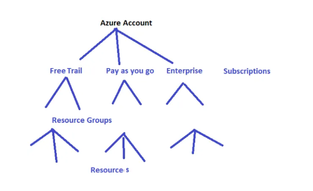
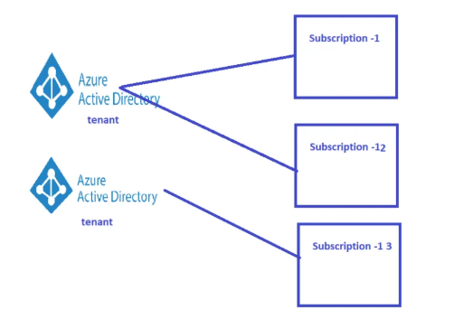

## Azure Active Directory
#### Azure Account, Subscriptions and Resource Groups

* Hierarchy is Azure Account can have multiple subscriptions

* Each Subscription can have multiple Resource Groups

* Each Resource Group can have multiple Resources

* Users need to login and create resources, so we need a platform for Identity

* Each Subscription is linked with only one Azure Active Directory(also referred as tenant)

* for more [info here](https://directdevops.blog/2019/01/28/azure-account-subscriptions/)

### What is Azure Active Directory
* Azure Active Directory (AAD) is Identity Platform.
* Its not Windows Active Directory Hosted on Azure Cloud.
* AAD Can give access to
    * Azure
    * Office 365
    * Applications (Mobile)

* In one simple Statement AAD is Identity as a Service
* AAD should be able to authenticate users and give then Authorizations. Users can be from
    * Windows Active Directory
    * Any other Directory Services
    * Any other OAUTH Based Identity Provider
    * Many other cases
#### AAD Major UseCases
* User Management (Authentication)
* Permission Management (Authorization/ RBAC )
* Active Directory Integrations
* Active Directory Federations
* Business To Business (B2B)
* Business To Consumer (B2C)

#### Azure Active Directory
    Users
    Groups
#### AAD RBAC
Can be applied at
    Subscription
    Resource Group
    Resource Level
#### Roles are
    Built in
    Custom
#### Popular Roles are
    Global Administrator
    Owner
    Co Owner
    Contributor
    Reader

* Roles assigned are inherited from parents to children
    * Roles assigned at Resource Groups are inherited to Resources
    * Roles assigned at Subscription level are inherited to Resource Groups and further to Resources.
    * User can add the new role assignments at Resource Group/Resource Level to change from inherited assignments
    * For further Reading, [Refer Here](https://docs.microsoft.com/en-us/azure/role-based-access-control/rbac-and-directory-admin-roles)

[Refer-for-more](https://directdevops.blog/2019/11/16/azure-classroom-series-16-nov-2019/)