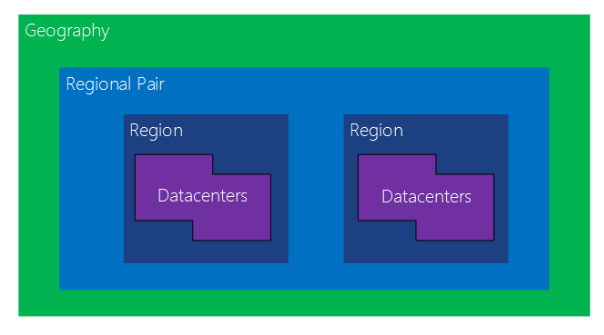
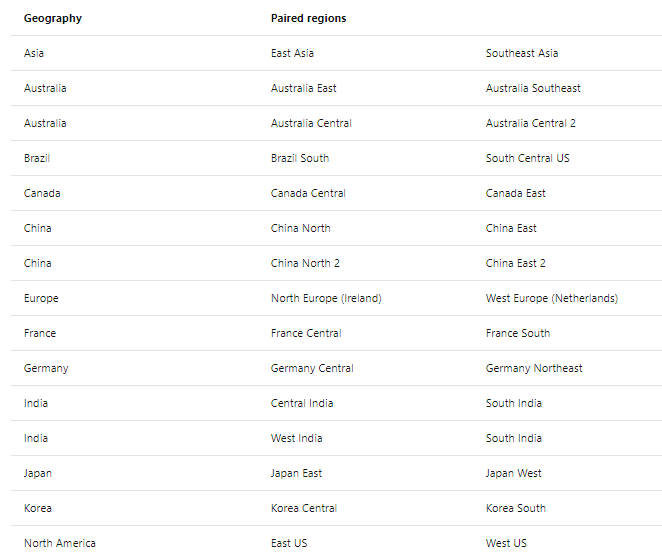
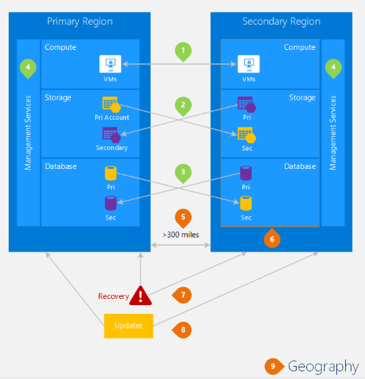

### Azure Global Infrastructure
## 1. Region: 

* Geographical location (locations => <direction> <Country> <number>, eg South India, Central US, East US2)

## 2. Inside Regions Do we have data centers?

* Yes: Is the case in many regions
* No: NOt the case, bcoz region is broken down into zones

## 3. Microsoft Azure gives better network speeds to reduce latency between some regions which are called as Paired Regions

## 4. Paired Region :
* Azure operates in multiple geographies around the world. An Azure geography is a defined area of the world that contains at least one Azure Region. 
* An Azure region is an area within a geography, containing one or more datacenters.

* Each Azure region is paired with another region within the same geography, together making a regional pair. The exception is Brazil South, which is paired with a region outside its geography. 
* Across the region pairs Azure serializes platform updates (planned maintenance), so that only one paired region is updated at a time. In the event of an outage affecting multiple regions, at least one region in each pair will be prioritized for recovery.

##### example for paired region

##### An example:2 of paired regions 

### Cross-region activities As referred to in figure 2.

#### 1.IaaS Azure Compute (IaaS) 
     You must provision additional compute resources in advance to ensure resources are available in another region during a disaster. For more information, see Azure resiliency technical guidance.

#### 2.Storage Azure Storage 
    If you're using managed disks, learn about cross-region backups with Azure Backup, and replicating VMs from one region to another with Azure Site Recovery. If you're using storage accounts, then geo-redundant storage (GRS) is configured by default when an Azure Storage account is created. With GRS, your data is automatically replicated three times within the primary region, and three times in the paired region. For more information, see Azure Storage Redundancy Options.

#### 3.Azure SQL Azure SQL Database 
     With Azure SQL Database Geo-Replication, you can configure asynchronous replication of transactions to any region in the world; however, we recommend you deploy these resources in a paired region for most disaster recovery scenarios. For more information, see Geo-Replication in Azure SQL Database.

#### 4.Resource Manager Azure Resource Manager 
    Resource Manager inherently provides logical isolation of components across regions. This means logical failures in one region are less likely to impact another.

### Benefits of paired regions As referred to in figure 2.

#### 5.Isolation Physical isolation  
    When possible, Azure prefers at least 300 miles of separation between datacenters in a regional pair, although this isn't practical or possible in all geographies. Physical datacenter separation reduces the likelihood of natural disasters, civil unrest, power outages, or physical network outages affecting both regions at once. Isolation is subject to the constraints within the geography (geography size, power/network infrastructure availability, regulations, etc.).

#### 6.Replication Platform-provided replication  
    Some services such as Geo-Redundant Storage provide automatic replication to the paired region.

#### 7.Recovery Region recovery order 
     In the event of a broad outage, recovery of one region is prioritized out of every pair. Applications that are deployed across paired regions are guaranteed to have one of the regions recovered with priority. If an application is deployed across regions that are not paired, recovery might be delayed – in the worst case the chosen regions may be the last two to be recovered.

#### 8.Updates Sequential updates 
    Planned Azure system updates are rolled out to paired regions sequentially (not at the same time) to minimize downtime, the effect of bugs, and logical failures in the rare event of a bad update.

#### 9.Data Data residency 
     A region resides within the same geography as its pair (with the exception of Brazil South) in order to meet data residency requirements for tax and law enforcement jurisdiction purposes.

## 5. Microsoft Global Network
[Refer here](https://azure.microsoft.com/en-in/global-infrastructure/global-network/)

# Main concepts in Azure cloud
1. Networking
2. Storage
3. Database
4. Monitoring
5. Migration
6. Azure devloper services
7. Azure devops
8. Arm templates
9. Powershell Application 
10. Azure Cli 

